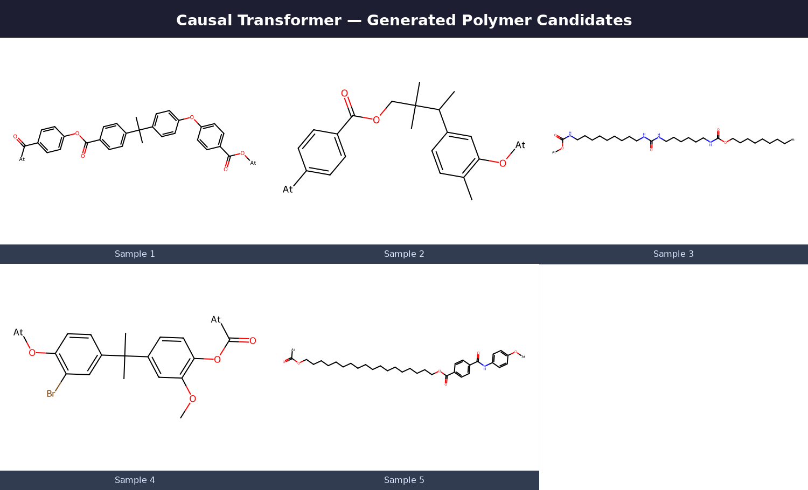

# Autoregressive Polymer PSELFIES Generation with Monte Carlo Tree Search (MCTS)

This repository contains the optimization and sequence generation pipeline for polymer discovery, combining a causal Autoregressive Transformer Language Model with an AlphaZero-style Monte Carlo Tree Search (MCTS) exploration loop.

## Overview
Unlike non-autoregressive discrete diffusion architectures, this framework utilizes token-by-token causal sequence modeling to construct valid polymer building blocks. The generative sequence generation is explicitly mapped onto polymer-adapted SELFIES (PSELFIES) and optimized via lookahead tree search.

* Causal Generative Backbone: Features a custom Autoregressive Transformer optimized for capturing dense sequential structural dependencies across discrete token vocabulary transitions.
* AlphaZero-Style Search Guidance: Integrates an active Monte Carlo Tree Search framework where the autoregressive transformer acts as the prior policy network, guiding token node selection and expansion during tree lookahead.
* Robust Grammatical Enforcements: Operating entirely on top of polymer-adapted SELFIES (PSELFIES), the search space completely eliminates the structural invalidity traps common to standard SMILES string generation.

**Note: This repository is being actively revised as part of a version 2 update to the model. The README and results above will be updated to reflect the new version once the repo changes are complete.**

---

## Pretrain Outputs

---

## Results
 
**Status: evaluation in progress.**
 
This repo implements Phase 3 (online MCTS-guided RL) of the pipeline for the
autoregressive transformer model.
 
Quantitative results for this repo — post-search validity rate, target-property MAE, and
xTB simulation success rate — will be added once the current evaluation run completes.
 
### Failure modes diagnosed (see full writeup below / in commit history)
 
- **The Ethane Trap:** policy collapsed to trivial `[At][C][C][At]` generation, diagnosed
  via a spike in KL divergence against the frozen reference policy. Fixed via a heavy-atom
  hard block, soft size discount, and a slowed KL beta schedule with a raised floor and
  hard threshold.

---

## Repository Structure

* model_ar.py — Core causal transformer token prediction logic and sequence modeling configurations.
* tokenizer_pselfies.py — Specialized vocabulary mapping and regular-expression parser handling polymer-adapted string serialization (PSELFIES).
* pretrain_ar.py — Main generative script to train the causal language model on structural text grammar before search execution.
* pretrain_ar.sh — High-performance computing shell script for cluster node pre-training execution.
* finetune_mcts_ar.py — Active search loop performing node exploration, rollout tracking, sequence tree updates, and optimized discovery streams.
* mcts_ar.sh — Batch engine shell script to execute the token search expansion loop.
* __init__.py — Python package initialization file.
* .gitignore — Specifies intentionally untracked files to keep the repository clean.

---

## Getting Started

### 1. Pre-training Phase
To train the baseline causal language model to master structural polymer text grammar before activating the search loop, execute the cluster pre-training shell script:
bash pretrain_ar.sh

### 2. MCTS Optimization Phase
To execute the token search expansion loop for directed generation and property optimization, run the primary batch engine script:
bash mcts_ar.sh

---

## Research Attribution
This codebase is a component of ongoing graduate research at the Georgia Institute of Technology (School of Materials Science & Engineering).

## Copyright & Licensing

This project is licensed under the MIT License - see the [LICENSE](LICENSE) file for details.
© 2026 Vansh Suresh Yadav. All rights reserved.
This code is intended exclusively for private research evaluation. Copying, distributing, or modifying these files without explicit authorization is strictly prohibited.
